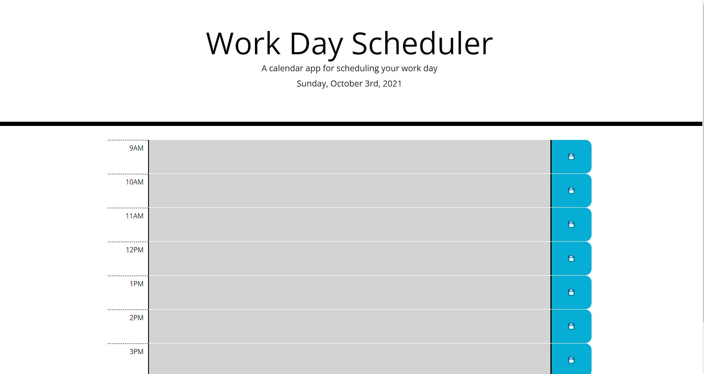

# Daily Planner
Sometimes all you need is a simple daily planner to tackle the day. As a developer the day can get away from you. If you don't track all the task you have, a lot of them may go incompleted. This app will allow you to track any task you have for the day. 

## Table of Contents
* [Usage](#Usage)
* [Test](#Test)
* [Questions](#Questions)

## Usage
Once you load the page you can enter any task you have for the day and hit the save icon to save your task. 

## Test

## Questions
Do you have questions? Contact me here:

* [Github](https://github.com/jameleggleston)
* [Email](jamel.eggleston@gmail.com)

Here is a link to the [website](https://jameleggleston.github.io/Daily-Planner/)

[Back to top](#Daily-Planer)